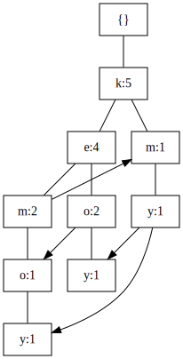

# hw2 110590049

tags `data`

[2023 Educational Data Mining and Applications HW2.pdf](../../assets/pdf/Educational_Data_Mining_and_Applications_HW2.pdf)

## 6.3
### a
1. Support(L) ≥ minimum support threshold. 
1. Since S is a subset of L, it means that any transaction containing all items in S also contains all items in L.
1. Support(S) ≥ Support(L) (because S includes all transactions that L includes)
1. Therefore, Support(S) ≥ minimum support threshold.
1. This proves that S is also a frequent itemset.
### b
1. S' ⊆ S
1. {T ∈ D | S ⊆ T} = Support(S) ,  all possible set T that is the superset of S
1. {T ∈ D | S ⊆ T} ⊆ {T ∈ D | S' ⊆ T}
1. Support(S) ≤ Support(S')
### c
1. Confidence(X => Y) = Support(X ∪ Y) / Support(X).
1. Confidence(s => {l-s}) = Support(s ∪ {l-s}) / Support({l-s}).
1. Confidence(s' => {l-s'}) = Support(s' ∪ {l-s'}) / Support({l-s'}).
1. Support(s' ∪ (l - s')) ≤ Support(s ∪ (l - s))
1. Support(s') ≤ Support(s)
1. Confidence(s' => (l - s')) ≤ Confidence(s => (l - s))

### d
1. If I is frequent in D, it must have a support count greater than or equal to the minimum support count threshold (minsup) for frequent itemsets in D.
2. If I is not frequent in any partition Pi, it must have a support count less than the minsup in each partition.
3. Any itemset that is frequent in the original database D must be frequent in at least one partition of D.

## 6.6
min_support=0.6 
min_confi=0.8 

|  ID   |       Items        |
| :---: | :----------------: |
| T100  | {M, O, N, K, E, Y} |
| T200  | {D, O, N, K, E, Y} |
| T300  |    {M, A, K, E}    |
| T400  |  {M, U, C, K, Y}   |
| T500  | {C, O, O, K, I, E} |
### a
#### Apriori algorithm
| 1-Itemsets                                                                                                                                                                                                                                                                                                                                                                                                                               | 2-Itemsets                                                                                                                                                                                                                                                                                                                                                                                                                                         | 3-Itemsets                                                                                                                                                                                                                                                                                                                                               |
| ---------------------------------------------------------------------------------------------------------------------------------------------------------------------------------------------------------------------------------------------------------------------------------------------------------------------------------------------------------------------------------------------------------------------------------------- | -------------------------------------------------------------------------------------------------------------------------------------------------------------------------------------------------------------------------------------------------------------------------------------------------------------------------------------------------------------------------------------------------------------------------------------------------- | -------------------------------------------------------------------------------------------------------------------------------------------------------------------------------------------------------------------------------------------------------------------------------------------------------------------------------------------------------- |
| <table><thead><tr><th>Item</th><th>Support</th></tr></thead><tbody><tr><td>K</td><td>1.0</td></tr><tr><td>E</td><td>0.8</td></tr><tr><td>Y</td><td>0.6</td></tr><tr><td>M</td><td>0.6</td></tr><tr><td>O</td><td>0.6</td></tr><tr><td>C</td><td>0.4</td></tr><tr><td>N</td><td>0.4</td></tr><tr><td>D</td><td>0.1</td></tr><tr><td>A</td><td>0.1</td></tr><tr><td>U</td><td>0.1</td></tr><tr><td>I</td><td>0.1</td></tr></tbody></table> | <table><thead><tr><th>Item</th><th>Support</th></tr></thead><tbody><tr><td>{K,E}</td><td>0.8</td></tr><tr><td>{K,Y}</td><td>0.6</td></tr><tr><td>{K,M}</td><td>0.6</td></tr><tr><td>{K,O}</td><td>0.6</td></tr><tr><td>{E,Y}</td><td>0.4</td></tr><tr><td>{E,M}</td><td>0.4</td></tr><tr><td>{E,O}</td><td>0.6</td></tr><tr><td>{Y,M}</td><td>0.4</td></tr><tr><td>{Y,O}</td><td>0.2</td></tr><tr><td>{M,O}</td><td>0.2</td></tr></tbody> </table> | <table><thead><tr><th>Item</th><th>Support</th></tr></thead><tbody><tr><td>{K,E,Y}</td><td>0.4</td></tr><tr><td>{K,E,M}</td><td>0.4</td></tr><tr><td>{K,E,O}</td><td>0.6</td></tr><tr><td>{K,Y,M}</td><td>0.4</td></tr><tr><td>{K,Y,O}</td><td>0.4</td></tr><tr><td>{K,M,O}</td><td>0.2</td></tr><tr><td>{K,M,E,O}</td><td>0.2</td></tr></tbody></table> |

| frequent itemsets              | support | Confidence |
| ------------------------------ | ------- | ---------- |
| $$\{E \}\rightarrow \{K,O \}$$ | 0.6     | 0.8        |
| $$\{O \}\rightarrow \{K,E \}$$ | 0.6     | 1.0        |
| $$\{K,O \}\rightarrow \{E \}$$ | 0.6     | 1.0        |
| $$\{E,O \}\rightarrow \{K \}$$ | 0.6     | 1.0        |

#### FP-growth algorithm

| itemsets | condition                   | support $\boldsymbol{\geq}$ 0.6 itemsets | frequent itemsets             |
| -------- | --------------------------- | ---------------------------------------- | ----------------------------- |
| e        | {k:4}                       | {k:4}                                    | $$\{E,K\} $$                  |
| m        | {e,k:2},{k:1}               | {k:3}                                    | $$\{M,K\}$$                   |
| o        | {k,e,m:1},{k,e:2}           | {k,3}{e:3}                               | $$\{O,K\},\{O,E\},\{O,E,K\}$$ |
| y        | {k,e,m:1},{k,e,o:1},{k,m:1} | {k:3}                                    | $$\{Y,K\}$$                   |

#### conclusion
By query 2 time to build FP-tree reduce the time to query database .So FP-growth is more efficient compared to a priori.
### b
| frequent itemsets              | support | Confidence |
| ------------------------------ | ------- | ---------- |
| $$\{K,O \}\rightarrow \{E \}$$ | 0.6     | 1.0        |
| $$\{E,O \}\rightarrow \{K \}$$ | 0.6     | 1.0        |

## 6.14
|      hot      | dogs  | !(hot dogs) | total |
| :-----------: | :---: | :---------: | :---: |
|  hamburgers   | 2000  |     500     | 2500  |
| !(hamburgers) | 1000  |    1500     | 2500  |
|     Total     | 3000  |    2000     | 5000  |
### a
$$
\text{support(hot dogs , hamburgers)}=P(\text{hot dogs}\cap \text{hamburgers} )=0.4
$$
$$
\text{confidence(hot dogs} \rightarrow \text{hamburgers)}=\frac{P(\text{hot dogs}\cap \text{hamburgers} )}{P(\text{hamburgers})}=0.8
$$
$$
0.4>0.25 \text{ and } 0.8 >0.5 \text{ so it is a strong rule}
$$
### b
$$
lift(\text{hot dogs}\rightarrow\text{hamburgers})=\frac{\frac{2000}{5000}}{\frac{3000}{5000}\frac{2500}{5000}}=\frac{4}{3}\\
\frac{4}{3}>1 \text{ so positively correlated}
$$
### c
$$

\begin{aligned}\\
AllConf(a,b)&=\frac{P(a \&  b)}{\max(P(a),P(b))}&=0.666\\
MaxConf(a,b)&=\max(P(a|b),P(b|a))&=0.8&\\
Kulc(a,b)&=\frac{1}{2}(P(b|a)+P(a|b))&=0.7333&\\
Cosine(a,b)&=\frac{a \cdot b}{|a|\times |b|}=\frac{2000}{\sqrt{2500\times 3000}}&=0.730&\\
Lift(a,b)&=\frac{P(a\& b)}{P(a)P(b)}&=1.333&\\
\end{aligned}\\
$$
