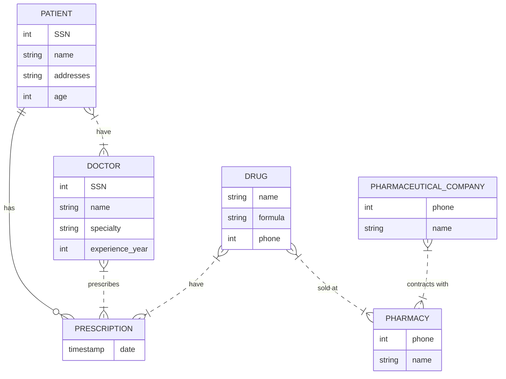
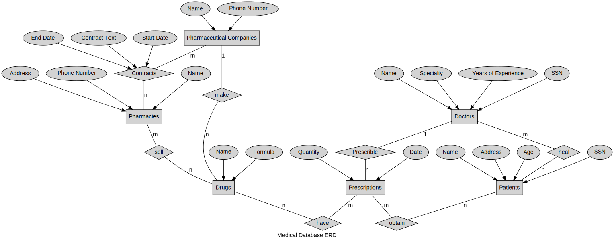
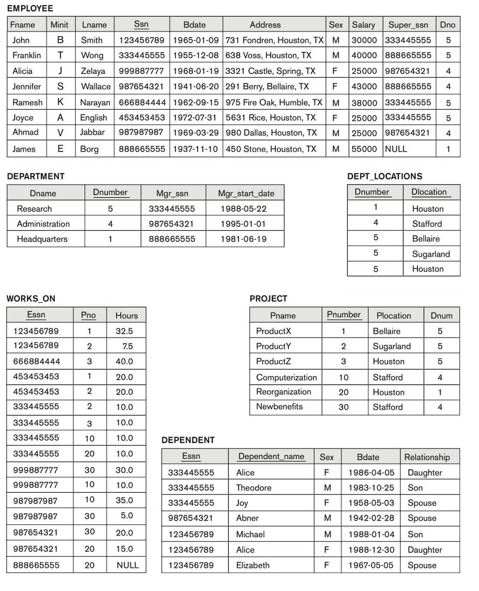
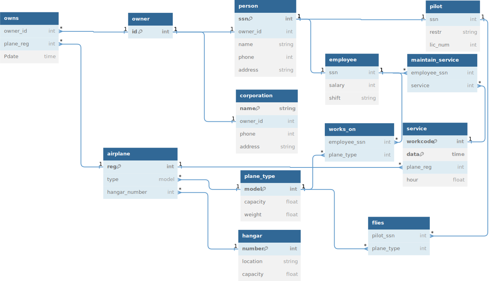

# hw2 110590049

tags `db` `database`

[2023 database-systems HW2.pdf](../../assets/pdf/database_systemsHW2.pdf)

# 1.
<!-- 

-->

because the doctor could be a patient too. and the pharmacy can sell drug from pharmaceutical company with different price of each another pharmacy.

## 2.

## 3.

### 3.a
If this row is pushed into the EMPLOYEE table, two persons will share the same super_ssn, but they will belong to different departments. This will result in inconsistency within the EMPLOYEE table.
### 3.b
The DEPT_LOCATIONS number should be 5, but this operation inserts 4 into it, resulting in inconsistency in the DEPT_LOCATIONS number.
### 3.c
No integrity constraints are violated.
### 3.d
Delete the PROJECT "ProductX" from the PROJECT table, and also delete the tuple from the WORKS_ON table where "Pno" is "1."
### 3.e
Change the super_ssn of employee "Alicia" to 943775544, making the supervisor of "Alicia" change to "Robert," who is in the department of research, while the department of "Alicia" is administration. This will result in inconsistency within the EMPLOYEE table.
### 3.f
If you modify the Pnumber from 30 to 40, you also need to change the row in the WORKS_ON table where Pno is 30 to 40. This will result in inconsistency within the WORKS_ON table.

## 4.

