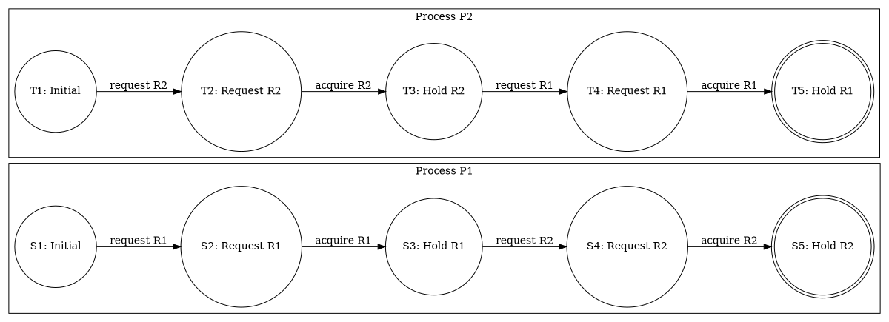
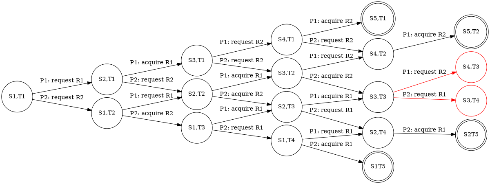

<!-- ---
title: cbmc(C bounded model checking) 
tags: Templates, Talk
description: View the slide with "Slide Mode".
--- -->


<style>
    .markdown-body b {
        font-weight: 700;
    }
    .markdown-body code,
    code,
	pre
	{
		max-height:80% !important;
        font-size: 14px;
        line-height: 115%;
        color: #99999 !important;
        background-color: #ffe9e5;
    }
    .reveal {
      font-size: 20px;
    }
</style>

# CBMC(C Bounded Model Checking) 

<!-- Put the link to this slide here so people can follow -->
<!-- slide: https://hackmd.io/p/template-Talk-slide -->

---

model checking  is a method for checking whether a finite-state model of a system meets a given specification.

---

## CBMC overview


---

program into a control flow graph


---

## program

```c
if ( (0 <= t) && (t <= 79) )
{
    switch ( t / 20 )
    {
        case 0:
            TEMP2 = ( (B AND C) OR (~B AND D) );
            break;
        case 1:
            TEMP2 = ( (B XOR C XOR D) );
            break;
        case 2:
            TEMP2 = ( (B AND C) OR (B AND D) OR (C AND D) );
            break;
        case 3:
            TEMP2 = ( B XOR C XOR D );
            break;
        default:
    }
    assert(TEMP2>0);
    
}

```

---

# code flow graph

 

---

# Linear temporal logic
* Linear temporal logic
    * **G** for always (globally)
    * **F** for finally
    * **R** for release
    * **W** for weak until
    * **M** for mighty release
* Computation tree logic
    * **A** – **A**ll
    * **E** – **E**xists
    * **X** - Ne**X**t


---

# Goal: check properties of the form AG p, satisfy assertions.


---

## SAT solver
https://www.inf.ufpr.br/dpasqualin/d3-dpll/
$$
p=
\begin{cases}
a \cup b \\
\neg a\\
\neg b\\
\end{cases}
$$
SAT solver will find instance that satisfy all $p$ cases

---

But SAT only can solve pure boolean satisfiability problem

$(t\leq 79)$ is boolean but $t$ is INT32 or INT8 how to convert it to pure boolean probleam

---

### convert code to conjunctive normal form for SAT solver


$$
p=(0 \leq t \leq 79 )\wedge (t/20\neq 0) \wedge (t/20=1) \wedge (\text{TEMP2}= B \text{ XOR } C \text{ XOR } D) 
$$

---

SAT will try to find the counter of 
$$
\begin{aligned}
&p=(0 \leq t \leq 79 )\wedge (t/20\neq 0) \wedge (t/20=1) \wedge (\text{TEMP2}= B \text{ XOR } C \text{ XOR } D)\\ 
&p=p\wedge \neg(\text{TEMP2}>0)
\end{aligned}
$$

### we can check is exist counter example of the form AG p

---


### convert to pure boolean

digital logic 
$$
\begin{aligned}
&A > B : A_1 \overline{B_1} + A_0 \overline{B_1} \overline{B_0} + A_1 A_0 \overline{B_0}\\
&p=(A_1 \vee A_0 \vee \neg B_0) \wedge (\neg B_1 \vee A_0 \vee \neg B_0) \wedge (A_1 \vee \neg B_1)
\end{aligned}
$$


---

## loop
```clike
while(cond){
    a++;
    assert(a<0);
}
```

---

## unrolling
bounded model checking bounded how deep we can unrolling
```clike
if(cond){
    a++;
    assert(a<0);
    if(cond){
        a++;
        assert(a<0);
        if(cond){
            a++;
            assert(a<0);
            if(cond){
                a++;
                assert(a<0);
                ....
            }
        }
    }
}
```

---

## unrolling optimization


---

## pointer bound
```c
int n;
int ∗p;
p=malloc(sizeof(int)∗5);
p[n]=100;
```

```c
int n;
int ∗p;
p=malloc(sizeof(int)∗5);

assert(0<=n && n<5);
p[n]=100;
```

---

## code example overflow
<!-- 
```bash!
 cbmc -function f01 example.c --compact-trace --drop-unused-functions  --bounds-check --pointer-check  --memory-leak-check --float-overflow-check --pointer-overflow-check --reachability-slice --unwind 128 
```
-->

```c
void f00 (int x, int y, int z) {
  if (x < y) {
    int firstSum = x + z;
    int secondSum = y + z;
    assert(firstSum < secondSum);
  }
}
```

```
example.c function f00
[f00.assertion.1] line 16 assertion firstSum < secondSum: FAILURE

Trace for f00.assertion.1:

↳ example.c:12 f00(-1275228454, 1113655513, -1157894487)
  14: firstSum=1861844355 (01101110 11111001 01111101 10000011)
  15: secondSum=-44238974 (11111101 01011100 11110111 10000010)

Violated property:
  file example.c function f00 line 16 thread 0
  assertion firstSum < secondSum
  firstSum < secondSum
```


---


## code example pointer


```c
void f15 (int x, int y) {
  int a[5]={1,2,3,4,5};

  int *b= (int *)malloc(5 * sizeof(int));
  for(int i=0;i<5;i++)
    b[i]=i;

  int *p=a;

  if(x==1 && y==1){
    // p=b+1; 
    p=&b[1];
    p[4]=5;
  }
  for(int i=0;i<5;i++){
    assert(a[i] == p[i]);
  }
  free(b);
}
```

---

## code example pointer

```
Trace for f15.pointer_dereference.12:

↳ example.c:143 f15(1, 1)
  144: a={ 1, 2, 3, 4, 5 } ({ 00000000 00000000 00000000 00000001, 00000000 00000000 00000000 00000010, 00000000 00000000 00000000 00000011, 00000000 00000000 00000000 00000100, 00000000 00000000 00000000 00000101 })
  144: a[0l]=1 (00000000 00000000 00000000 00000001)
  144: a[1l]=2 (00000000 00000000 00000000 00000010)
  144: a[2l]=3 (00000000 00000000 00000000 00000011)
  144: a[3l]=4 (00000000 00000000 00000000 00000100)
  144: a[4l]=5 (00000000 00000000 00000000 00000101)

↳ example.c:146 malloc(sizeof(signed int) * 5ul /*20ul*/ )
  12: dynamic_object1[0l]=0 (00000000 00000000 00000000 00000000)
  12: dynamic_object1[1l]=0 (00000000 00000000 00000000 00000000)
  12: dynamic_object1[2l]=0 (00000000 00000000 00000000 00000000)
  12: dynamic_object1[3l]=0 (00000000 00000000 00000000 00000000)
  12: dynamic_object1[4l]=0 (00000000 00000000 00000000 00000000)
  146: b=dynamic_object1 (00000010 00000000 00000000 00000000 00000000 00000000 00000000 00000000)
  147: i=0 (00000000 00000000 00000000 00000000)
  148: dynamic_object1[0l]=0 (00000000 00000000 00000000 00000000)
  147: i=1 (00000000 00000000 00000000 00000001)
  148: dynamic_object1[1l]=1 (00000000 00000000 00000000 00000001)
  147: i=2 (00000000 00000000 00000000 00000010)
  148: dynamic_object1[2l]=2 (00000000 00000000 00000000 00000010)
  147: i=3 (00000000 00000000 00000000 00000011)
  148: dynamic_object1[3l]=3 (00000000 00000000 00000000 00000011)
  147: i=4 (00000000 00000000 00000000 00000100)
  148: dynamic_object1[4l]=4 (00000000 00000000 00000000 00000100)
  147: i=5 (00000000 00000000 00000000 00000101)
  150: p=((signed int *)NULL) (00000000 00000000 00000000 00000000 00000000 00000000 00000000 00000000)
  151: p=a!0@1 (00000011 00000000 00000000 00000000 00000000 00000000 00000000 00000000)
  155: p=dynamic_object1 + 1l (00000010 00000000 00000000 00000000 00000000 00000000 00000000 00000100)

Violated property:
  file example.c function f15 line 156 thread 0
  dereference failure: pointer outside dynamic object bounds in p[(signed long int)4]
  16l + POINTER_OFFSET(p) >= 0l && __CPROVER_malloc_size >= 20ul + (unsigned long int)POINTER_OFFSET(p) || !(POINTER_OBJECT(p) == POINTER_OBJECT(__CPROVER_malloc_object))

```


---


## code example multiple

```c
void f14 (int x, int y) {
    int a = x;
    int b = y;
    assert(a*b == x*y);
}
```


---


## code example multiple MiniSAT

```
CBMC version 5.12 (cbmc-5.12) 64-bit x86_64 linux
Parsing example.c
Converting
Type-checking example
Generating GOTO Program
Adding CPROVER library (x86_64)
Removal of function pointers and virtual functions
Generic Property Instrumentation
Removing unused functions
Dropping 14 of 17 functions (3 used)
Performing a reachability slice
Running with 8 object bits, 56 offset bits (default)
Starting Bounded Model Checking
size of program expression: 47 steps
simple slicing removed 4 assignments
Generated 2 VCC(s), 1 remaining after simplification
Passing problem to propositional reduction
converting SSA
Running propositional reduction
Post-processing
Solving with MiniSAT 2.2.1 with simplifier
3817 variables, 18930 clauses
SAT checker: instance is UNSATISFIABLE
Runtime decision procedure: 477.908s

** Results:
function __CPROVER__start
[__CPROVER__start.memory-leak.1] dynamically allocated memory never freed in __CPROVER_memory_leak == NULL: SUCCESS

example.c function f14
[f14.assertion.1] line 140 assertion a*b == x*y: SUCCESS

** 0 of 2 failed (1 iterations)
VERIFICATION SUCCESSFUL
```

---


## code example multiple Z3

```
CBMC version 5.12 (cbmc-5.12) 64-bit x86_64 linux
Parsing example.c
Converting
Type-checking example
Generating GOTO Program
Adding CPROVER library (x86_64)
Removal of function pointers and virtual functions
Generic Property Instrumentation
Removing unused functions
Dropping 15 of 18 functions (3 used)
Performing a reachability slice
Running with 8 object bits, 56 offset bits (default)
Starting Bounded Model Checking
size of program expression: 47 steps
simple slicing removed 4 assignments
Generated 2 VCC(s), 1 remaining after simplification
Passing problem to SMT2 QF_AUFBV using Z3
converting SSA
Running SMT2 QF_AUFBV using Z3
Runtime decision procedure: 0.00870986s

** Results:
function __CPROVER__start
[__CPROVER__start.memory-leak.1] dynamically allocated memory never freed in __CPROVER_memory_leak == NULL: SUCCESS

example.c function f14
[f14.assertion.1] line 140 assertion a*b == x*y: SUCCESS

** 0 of 2 failed (1 iterations)
VERIFICATION SUCCESSFUL
```

---

# SPIN

---

## SPIN

* promela language
* deadlock deletction


---


---

### promela language


---


---

## two process FSM



---

## the state that is not final state but have no next state is the deadlock state





---

## convert property check to LTL expression


---

## alot of work are try reduce computation to save time

---

## summary 

* use interactive and random simulations get the all reachable states and transction
* use the states and transction build finite-state machine
* check the is any counter example of assert
* property check to LTL to check all the reachable state is fit the property


---

## ref

* https://www.cprover.org/cbmc/doc/cbmc-slides.pdf
* https://spinroot.com/spin/Doc/Spin_tutorial_2004.pdf
* https://www.cs.cmu.edu/~aldrich/courses/654-sp05/handouts/model-checking-5.pdf
