# hw2

[OS_HW2.pdf](../../assets/pdf/operating_system_HW2.pdf)

## 4.8

I/O heavy task because mulithreading not speedup I/O speed

```c
#include <stdio.h>
#include <stdlib.h>
#include <pthread.h>

#define NUM_THREADS 4
#define ITERATIONS_PER_THREAD 10

void *io_bound_task(void *thread_id) {
    long tid;
    tid = (long)thread_id;
    FILE *file;
    char filename[20];
    sprintf(filename, "file_%ld.txt", tid);

    for (int i = 0; i < ITERATIONS_PER_THREAD; i++) {
        file = fopen(filename, "a");
        if (file != NULL) {
            fprintf(file, "Thread %ld writing to file %d\n", tid, i);
            fclose(file);
        }
    }
    pthread_exit(NULL);
}

int main() {
    pthread_t threads[NUM_THREADS];
    int rc;
    long t;

    for (t = 0; t < NUM_THREADS; t++) {
        rc = pthread_create(&threads[t], NULL, io_bound_task, (void *)t);
        if (rc) {
            printf("ERROR; return code from pthread_create() is %d\n", rc);
            exit(-1);
        }
    }

    pthread_exit(NULL);
}

```
## 4.10

- B. Heap memory
- C. Global variables

## 4.16
* How many threads will you create to perform the input and output? Explain.
  * 1 threads
  * input and output require single file operation which is cant be parallel
* How many threads will you create for the CPU-intensive portion of the application? Explain
  * 4 thread
  * since task can be parallel to reduce time 

## 5.14
* Each processing core has its own run queue
  * Advantages
    * better cache utilization
  * Disadvantages
    * increased complexity 
* single run queue
  * Advantages
    * easy balanced workload
  * Disadvantages
    * thread cache coherence 
## 5.18


| process | priority | burst time | arrival |
| ------- | -------- | ---------- | ------- |
| $P_1$   | 8        | 15         | 0       |
| $P_2$   | 3        | 20         | 0       |
| $P_3$   | 4        | 20         | 20      |
| $P_4$   | 4        | 20         | 25      |
| $P_5$   | 5        | 5          | 45      |
| $P_6$   | 10       | 15         | 55      |

<!-- ## priority-based+round-robin -->
<!-- ```mermaid
gantt
    title task time
    dateFormat X
    axisFormat %s

    section P1
      P1   : 0, 15
    section P2
      P2   : 0, 20
    section P3
      P3   : 20, 40
    section P4
      P4   : 25, 45
    section P5
      P5   : 45, 50
    section P6
      P6   : 55, 70

``` -->

```mermaid
---
displayMode: compact
---
gantt
    title task scheduling order
    dateFormat X
    axisFormat %s
    tickInterval 5second

    section P1 priority 8
      P1   : 0, 15
    section P2 priority 3
      P2   : 15, 20
      P2   : 80, 95
    section P3 priority 4
      P3   : 20, 30
      P3   : 40, 45
      P3   : 70, 75
    section P4 priority 4
      P4   : 30, 40
      P4   : 50, 55
      P4   : 75, 80
    section P5 priority 5
      P5   : 45, 50
    section P6 priority 10
      P6   : 55, 70

```

|     | turnaround time | waiting time |
| --- | --------------- | ------------ |
| P1  | 15-0=15         | 0            |
| P2  | 95-0=95         | 95-20=75     |
| P3  | 75-20=55        | 55-20=35     |
| P4  | 80-25=55        | 55-20=35     |
| P5  | 50-45=5         | 0            |
| P6  | 70-55=15        | 0            |

## 5.22


    
## 5.25

* FCFS
  * run task by arrival time
  * doesn't discriminate in favor of short processes  
* RR
  * keep each process be run by CPU equality 
  * doesn't discriminate in favor of short processes
* Multilevel Feedback queues
  * can prioritize short processes by setting 

## 6.7
## 6.15
## 6.18
