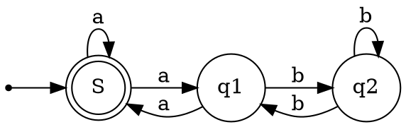

# Formal Language

tags: `math` 
<!--   -->

[link](https://carquois42.github.io/formal.html)

# automata
* DFA(Deterministic Finite Automation)
* NFA(Nondeterministic Finite Automation)
# DFA NFA 
# regular expression
$$
% \begin{cases}
\begin{aligned}
\empty&=\text{empty set}\\
\epsilon&=\text{empty expression}\\
\circ&=\text{concat}\\
R^{k}&=\underbrace{R\circ R \circ \cdots \circ R}_{k \text{ times}}\\
R^+ &=R\circ R^{*}\\
R^* &=R^{+} \cup \epsilon\\
\end{aligned}
% \end{cases}
$$

# NFA == regular expression 

For every NFA $N$ there is a regular expression $R$ such that $L(R) = L(N)$

L(q,p,k){w ∈ $\Sigma^∗$ | there is a run of M on w from state q to state p and let passing through states set length < k}.

# NFA to regular expression
## state removal method

## brzozowski algebraic method

