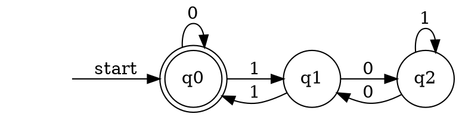
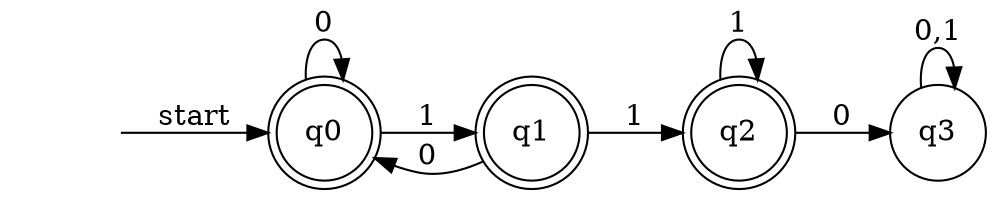
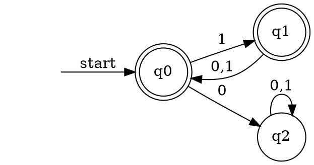
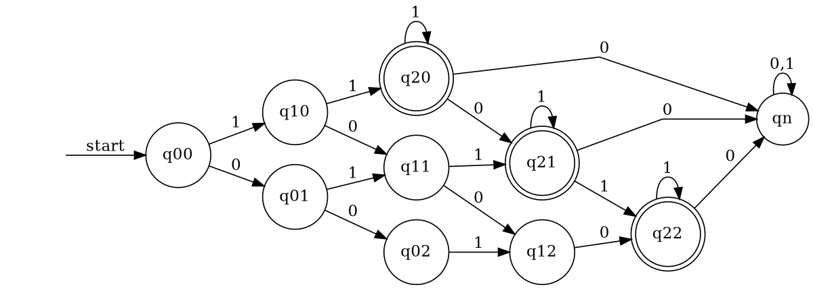
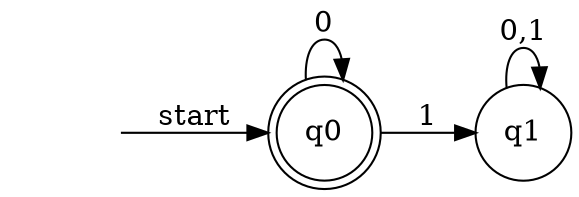
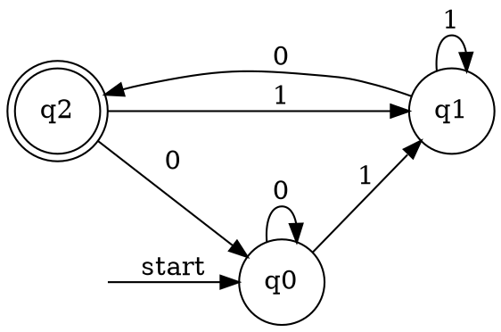
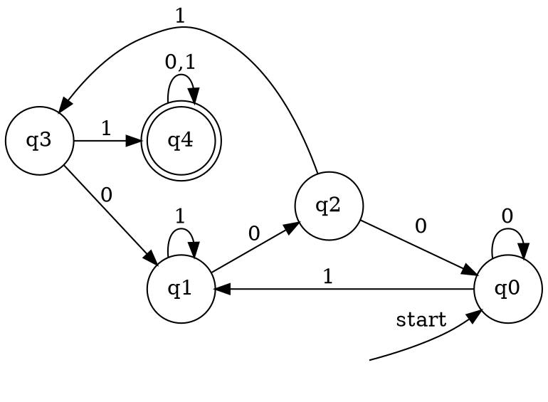
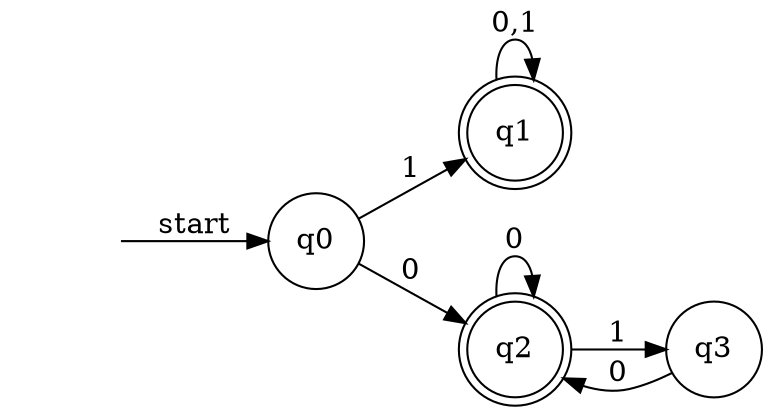
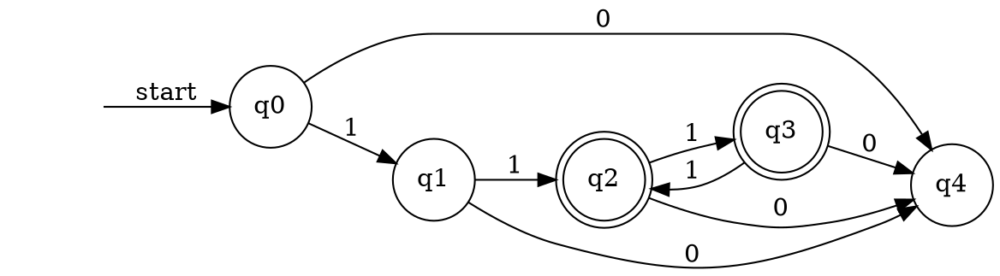

# hw1

[formal_language_HW1.pdf](../../assets/pdf/formal_language_HW1.pdf)

# 1.a

# 1.b

# 1.c

# 1.d

# 1.e

# 2.a

$$
\begin{aligned}
Q_1&=a Q_2 \cup b Q_1 =b^*aQ_2\\
Q_2&=a Q_2 \cup b Q_0= a^*bQ_0\\
\\
Q_0&=b Q_1 \cup aQ_0 \cup \epsilon\\
&=a^*bQ_1 \cup \epsilon\\
&=a^*b(b^*aQ_2) \cup \epsilon\\
&=a^*bb^*a(a^*bQ_0) \cup \epsilon\\
&=a^*b^+a^+bQ_0 \cup \epsilon\\
&=(a^*b^+a^+b)^* \cup \epsilon\\
&=(a^*b^+a^+b)^*\\
\end{aligned}
% R=(a^* b^+a^+b)^\ast \cup \epsilon
$$

# 2.b

$$
R=((a^*\cup b)b (bb)^*a )^*
$$

# 3.a

todo

# 3.b

todo

# 3.c

# 3.d

# 3.e

# 4.a

$$
R=(0^* 1^+ )^3\Sigma^*
$$

[ref](https://chat.openai.com/share/9d8e1c78-f6ec-47b3-957c-38226e5fa2df)

# 4.b

todo

$$
R=\Sigma^*0\Sigma^*0\Sigma^*
$$

[ref](https://chat.openai.com/share/e9bbc771-30ac-49e0-a95b-5d3b1c4b352b)

# 4.c

$$
R=( 1 \circ  \Sigma )^*
$$

# 5

# 6.a

$$
\begin{aligned}
L^*&=\bigcup_{i \in \N}L^i\\
L^{**}&=(\bigcup_{i \in \N}L^i)^*\\
&=\bigcup_{j \in \N}(\bigcup_{i \in \N}L^i)^j\\
&=\bigcup_{j \in \N}\bigcup_{i \in \N}L^{ij}\\
&=\bigcup_{ij \in \N}L^{ij}\\
&=L^*\\
\end{aligned}
$$

$$
\begin{aligned}
L^*L^*&=(L^+\cup \epsilon)(L^+\cup \epsilon)\\
&=LL^+\cup  L^+ \cup \epsilon\\
&=L^*
\end{aligned}
$$

# 6.b

<!-- $$
\text{let }\delta(q,p,i) = \text{all the transaction set of from state }q\text{ to state }p \text{ and passing through state set length } \leq i
$$ -->
