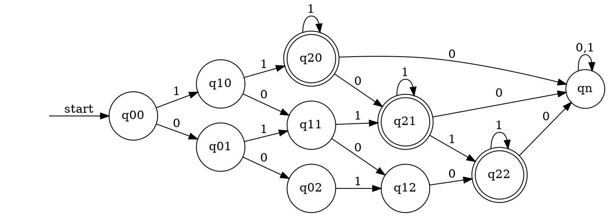

# hw1

[formal_language_HW1.pdf](../../assets/pdf/formal_language_HW1.pdf)

# 1.a

# 1.b

# 1.c

# 1.d

# 1.e

# 2.a

$$
\begin{aligned}
Q_1&=a Q_2 \cup b Q_1 =b^*aQ_2\\
Q_2&=a Q_2 \cup b Q_0= a^*bQ_0\\
\\
Q_0&=b Q_1 \cup aQ_0 \cup \epsilon\\
&=a^*bQ_1 \cup \epsilon\\
&=a^*b(b^*aQ_2) \cup \epsilon\\
&=a^*bb^*a(a^*bQ_0) \cup \epsilon\\
&=a^*b^+a^+bQ_0 \cup \epsilon\\
&=(a^*b^+a^+b)^* \cup \epsilon\\
&=(a^*b^+a^+b)^*\\
\end{aligned}
% R=(a^* b^+a^+b)^\ast \cup \epsilon
$$

# 2.b

$$
R=((a^*\cup b)b (bb)^*a )^*
$$

# 3.a

# 3.b

# 3.c

# 3.d

# 3.e

# 4.a

$$
R=(0^* 1^+ )^3\Sigma^*
$$

[ref](https://chat.openai.com/share/9d8e1c78-f6ec-47b3-957c-38226e5fa2df)

# 4.b

$$
R=(1^+ 0 1^+ 0 1^*)\cup(1^* 0 1^+ 0 1^+)\cup(11^+ 01^*01^*)\cup(1^*01^*011^+)\cup(011^+0)
$$

# 4.c

$$
R=( 1 \circ  \Sigma )^*
$$

# 5

If $L$ is regular, then $\min(L)$ is also regular because $\min(L)$ is $L$ but remove the final state that be passing though another final state.

**for example**

$$
L=(ab\cup abc\cup abcd \cup ac )
$$

$$
min(L)=(ab\cup ac )
$$

# 6.a

$$
\begin{aligned}
L^*&=\bigcup_{i \in \N}L^i\\
L^{**}&=(\bigcup_{i \in \N}L^i)^*\\
&=\bigcup_{j \in \N}(\bigcup_{i \in \N}L^i)^j\\
&=\bigcup_{j \in \N}\bigcup_{i \in \N}L^{ij}\\
&=\bigcup_{ij \in \N}L^{ij}\\
&=L^*\\
\end{aligned}
$$

$$
\begin{aligned}
L^*L^*&=(L^+\cup \epsilon)(L^+\cup \epsilon)\\
&=LL^+\cup  L^+ \cup \epsilon\\
&=L^*
\end{aligned}
$$

# 6.b

$$
A \text{ is a finite language, then it contains a finite number of strings }a_0,a_1,\cdots,a_n\\
\text{The language }\{a_i\} \text{ consisting of a single literal string }a_i\text{ is regular }\\
\text{The union of a finite number of regular languages is also regular.}\\
\text{Therefore } A=a_0,a_1,\cdots,a_n \text{ is regular}
$$

[ref](https://cs.stackexchange.com/questions/104322/why-is-every-finite-language-a-%E2%8A%86-%CE%A3-regular)

# 6.c

$$
A \subseteq B\\
A=\{a^nb^n|n\in \N_0\}\\
B=\{(a\cup b)^n|n\in \N_0\}\\
$$

# 6.d

$$
B \subseteq A\\
A=\{a^nb^n|n\in \N_0\}\\
B=\{w|w=ab \}\\
$$

# 6.e

$$

L^{(\frac{1}{3})}=\{w|w^3\in L\}\\
$$

$$
L^{(\frac{1}{3})} \text{ mean all the solution that in } L \text{ that can divide to 3 exact same part}\\

$$

# 6.f

$$
L^{(3)}=\{w^3|w\in L\}\\
\text{since } L \text{ is regular so is } L^3.\text{(regular closure)}
$$

[ref (Formal definition)](https://en.wikipedia.org/wiki/Regular_language)

# 6.g

todo

since $w^*$ and $L$ is regular make $(w^* \cap L)$ is regular. ([ref](https://stackoverflow.com/questions/58317350/can-the-intersection-of-two-regular-languages-be-non-regular))

# 6.h

$$
L^{\frac{1}{\infty}}=L^{1} \cap L^{\frac{1}{2}} \cdots  \cap L^{\frac{1}{\infty}}\\
\text{since } L\text{ is regular so is the }L^{\frac{1}{n}}\\
 L^{\infty}\text{ are regular because it is interest of } L^{\frac{1}{n}}\\
$$

# 6.i

$$

\sqrt{L} =\bigcup_{k\leq 1} L^{\frac{1}{k}}\\
\sqrt{L}\text{ is regular by union closure}
$$

# 6.j

$$
L^{\infty}=L^{1} \cup L^{2} \cdots  \cup L^{\infty}\\
\text{since } L\text{ is regular so is the }L^{n}\\
 L^{\infty}\text{ are regular because it is union of } L^n\\
$$

# 7.a

$$
L=\{wcw| w\in \{a,b\}^*\}
$$

$$
wcw=(a\cup b)^i c(a\cup b)^i\\
(a\cup b)^i c(a\cup b)^j=\underbrace{(a\cup b)^{p-i}}_{x} \ \ \underbrace{(a\cup b)^{i}}_{y} \ \ \underbrace{c(a\cup b)^{p}}_{z} \text{ and }i>0\\
\text{By pumping lemma}\\
|y|\geq 1\\
|xy| \leq p\\
(\forall i  \geq  0)(xy^iz \in L )\\
\text{But }xy^0z=(a\cup b)^{p-i}c(a\cup b)^p \notin L \\
\text{Therefor this is not regular languages}

$$

# 7.b

$$
L=\{xy| x,y\in \{a,b\}^* \text{ and } |x|=|y|\}
$$

$$
xy=\{a,b\}^p\{a,b\}^p\\
\{a,b\}^p\{a,b\}^p=\underbrace{\{a,b\}^{p-2}}_{x} \ \ \underbrace{\{a,b\}^{2}}_{y} \ \ \underbrace{\{a,b\}^{p}}_{z}\\
|y|\geq 1\\
|xy| \leq p\\
(\forall i  \geq  0)(xy^iz \in L )\\
\text{By pumping lemma this is regular languages}
$$

# 7.c

$$
L = \{a^n | n \text{ is a prime number}\}
$$

$$
a^p=\underbrace{a^{p-j-1}}_x \underbrace{a^1}_y  \underbrace{a^{j}}_z\\
|y|\geq 1 \\
|xy| \leq p\\
(\forall i  \geq  0)(xy^iz \in L )\\
\text{But }xy^0z=a^{p-j-1}a^{j}=a^{p-1}\notin L \\
\text{Therefor this is not regular languages}
$$

# 7.d

$$
L = \{a^mb^n | gcd(m, n) = 17\}
$$

$$
j,k\in \N \text{ and }gcd(j,k)=1 \\
\text{ then }a^mb^n=a^{17j}b^{17k}\\
a^mb^n=\underbrace{a^{17j-1}}_x \underbrace{a^1}_y  \underbrace{b^{17k}}_z\\
|y|\geq 1 \\
|xy| \leq p\\
(\forall i  \geq  0)(xy^iz \in L )\\
\text{But }xy^0z=a^{17j-1}b^{17k}\notin L \\
\text{Therefor this is not regular languages}
$$

# 9.a

Each symbols need 2 state to record is even or odd state and additional one state for init state; total 2n+1 state.

# 9.b

Because DFA each state have determine result to next state by input. We need to know all symbols is even or odd in one state.
So each symbols have two possible (even or odd) lead to $2^n$ state
