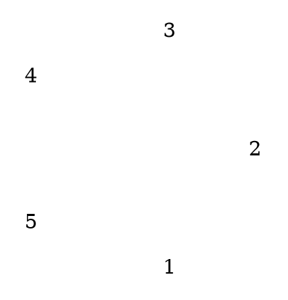
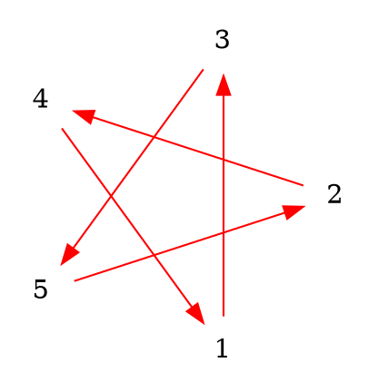

<style>
    .markdown-body b {
        font-weight: 700;
    }
    .markdown-body code,
    code,
	pre
	{
		max-height:80% !important;
        font-size: 14px;
        line-height: 115%;
        color: #99999 !important;
        background-color: #ffe9e5;
    }
    .reveal {
      font-size: 20px;
    }
</style>
# 循環賽

<!-- Put the link to this slide here so people can follow -->
<!-- slide: https://hackmd.io/p/template-Talk-slide -->

---

## 題目 
下圖為五位選手的比賽結果
a->b表示 a 獲勝


---

## 矩陣



$$A=\begin{bmatrix}
 0 & 1 & 0 & 1 & 0 \\
 0 & 0 & 1 & 1 & 0 \\
 1 & 0 & 0 & 0 & 0 \\
 0 & 0 & 1 & 0 & 1 \\
 1 & 1 & 1 & 0 & 0 \\
\end{bmatrix}
$$

---

# $s^{(i)}$
$s^{(i)}=As^{(i-1)}$
$$s^{(1)}=\begin{bmatrix}
 0 & 1 & 0 & 1 & 0 \\
 0 & 0 & 1 & 1 & 0 \\
 1 & 0 & 0 & 0 & 0 \\
 0 & 0 & 1 & 0 & 1 \\
 1 & 1 & 1 & 0 & 0 \\
\end{bmatrix}
\begin{bmatrix}
1\\
1\\
1\\
1\\
1\\
\end{bmatrix}=
\begin{bmatrix}
2\\
2\\
1\\
2\\
3\\
\end{bmatrix}
\\
s^{(2)}=\begin{bmatrix}
 0 & 1 & 0 & 1 & 0 \\
 0 & 0 & 1 & 1 & 0 \\
 1 & 0 & 0 & 0 & 0 \\
 0 & 0 & 1 & 0 & 1 \\
 1 & 1 & 1 & 0 & 0 \\
\end{bmatrix}
\begin{bmatrix}
2\\
2\\
1\\
2\\
3\\
\end{bmatrix}=
2\begin{bmatrix}
0\\
0\\
1\\
0\\
1\\
\end{bmatrix}
+2\begin{bmatrix}
1\\
0\\
0\\
0\\
1\\
\end{bmatrix}
+1\begin{bmatrix}
0\\
1\\
0\\
1\\
1\\
\end{bmatrix}
+2\begin{bmatrix}
1\\
1\\
0\\
0\\
0\\
\end{bmatrix}
+3\begin{bmatrix}
0\\
0\\
0\\
1\\
0\\
\end{bmatrix}=\begin{bmatrix}
4\\
3\\
2\\
4\\
5\\
\end{bmatrix}
$$

---

## 循環


$$
A=\begin{bmatrix}
 0 & 1 & 1 & 0 & 0 \\
 0 & 0 & 1 & 1 & 0 \\
 0 & 0 & 0 & 1 & 1 \\
 1 & 0 & 0 & 0 & 1 \\
 1 & 1 & 0 & 0 & 0 \\
\end{bmatrix}
$$

---

## 循環

$$
s^{(1)}=\begin{bmatrix}
 0 & 1 & 1 & 0 & 0 \\
 0 & 0 & 1 & 1 & 0 \\
 0 & 0 & 0 & 1 & 1 \\
 1 & 0 & 0 & 0 & 1 \\
 1 & 1 & 0 & 0 & 0 \\
\end{bmatrix}
\begin{bmatrix}
1\\
1\\
1\\
1\\
1\\
\end{bmatrix}=
\begin{bmatrix}
2\\
2\\
2\\
2\\
2\\
\end{bmatrix}\\
s^{(2)}=\begin{bmatrix}
 0 & 1 & 1 & 0 & 0 \\
 0 & 0 & 1 & 1 & 0 \\
 0 & 0 & 0 & 1 & 1 \\
 1 & 0 & 0 & 0 & 1 \\
 1 & 1 & 0 & 0 & 0 \\
\end{bmatrix}
\begin{bmatrix}
2\\
2\\
2\\
2\\
2\\
\end{bmatrix}=
\begin{bmatrix}
4\\
4\\
4\\
4\\
4\\
\end{bmatrix}
$$
$$As=\lambda s$$


## $s^{(i)},i=?$ 

 ```dot process
digraph google{
    // layout=neato;
    layout=circo;
	// layout=twopi;
    fontname="Helvetica,Arial,sans-serif"
    fontcolor=white
    bgcolor="transparent"
     //bgcolor="black"
    node[shape=circle,style=filled,color=white,colorscheme=ylgnbu7]
    edge[color=white]
    // label="real world"
	1->2
    2->3[color=green]
    3->4
    4->5
    5->6[color=green,dir=back]
    6->1
    
    
    1->3[color=red]
    3->5[color=red]
    5->1[color=red]
    
    2->4[color=red]
    4->6[color=red]
    6->2[color=red]
    
    1->4[color=green]
    5->2
    3->6
}
``` 

$$A=\begin{bmatrix}
 0 & 1 & 1 & 0 & 0 & 0\\
 0 & 0 & 1 & 1 & 0 & 0\\
 0 & 0 & 0 & 1 & 1 & 0\\
 0 & 0 & 0 & 0 & 1 & 1\\
 1 & 0 & 0 & 0 & 0 & \color{red} 0\\
 1 & 1 & 0 & 0 & \color{red}1 & 0\\
\end{bmatrix}
$$
$$
s^{(1)}=
\begin{bmatrix}
2\\
2\\
2\\
2\\
1\\
3\\
\end{bmatrix},
s^{(2)}=
\begin{bmatrix}
4\\
4\\
3\\
4\\
2\\
5\\
\end{bmatrix},
s^{(3)}=
\begin{bmatrix}
7\\
7\\
6\\
7\\
4\\
10\\
\end{bmatrix},
s^{(4)}=
\begin{bmatrix}
13\\
13\\
11\\
14\\
7\\
18\\
\end{bmatrix},
s^{(5)}=
\begin{bmatrix}
24\\
25\\
21\\
25\\
13\\
33\\
\end{bmatrix},
s^{(6)}=
\begin{bmatrix}
46\\
46\\
38\\
46\\
24\\
62\\
\end{bmatrix},
s^{(7)}=
\begin{bmatrix}
84\\
84\\
70\\
86\\
46\\
116\\
\end{bmatrix},
$$
