# dot process

tags: `graphviz`

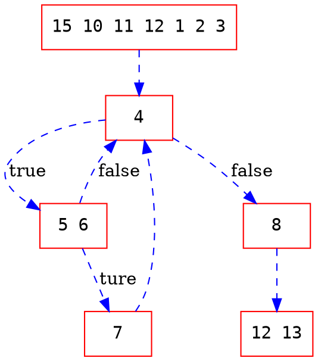

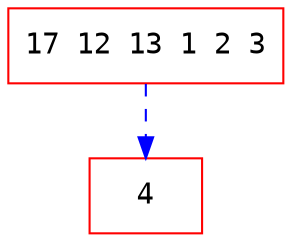

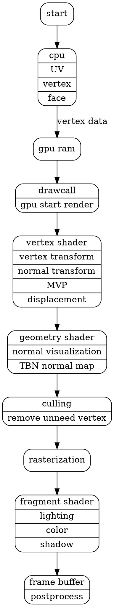

```dot process
digraph google{
    // layout=neato;
    // layout=circo;
	// layout=twopi;
    fontname="Helvetica,Arial,sans-serif"
    fontcolor=white
    // bgcolor="black"
    // bgcolor="transparent"
    node[shape=circle,style=filled,color=white,colorscheme=ylgnbu7]
    edge[color=white,dir="both"]
    label="node tree 001 to 101 "
	"000"
	"001"
	"010"
	"011"
	"100"
	"101"
	"110"
	"111"
	"000"
}
```

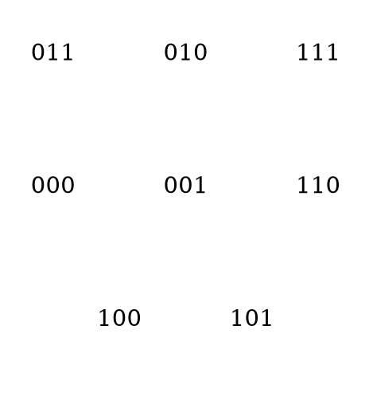

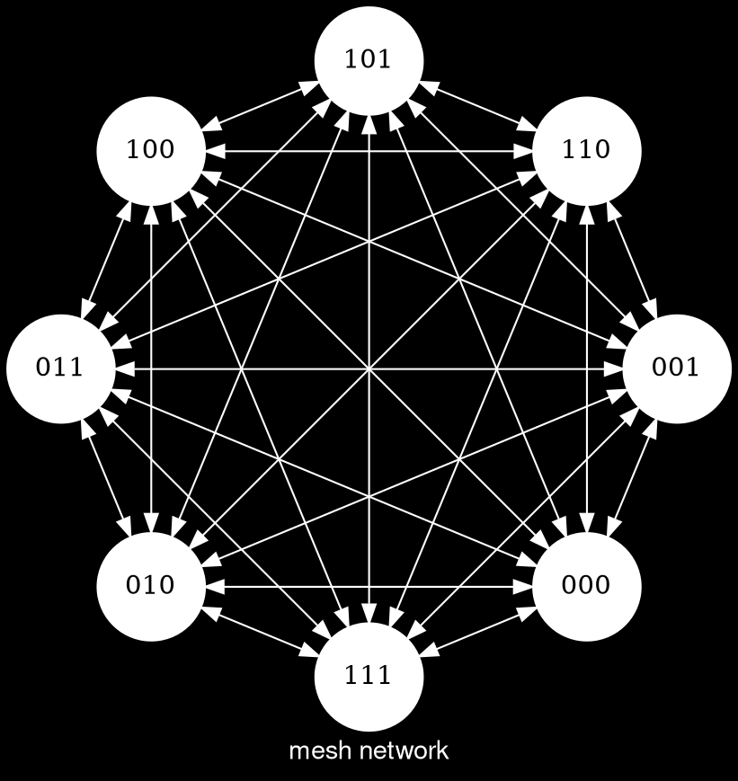

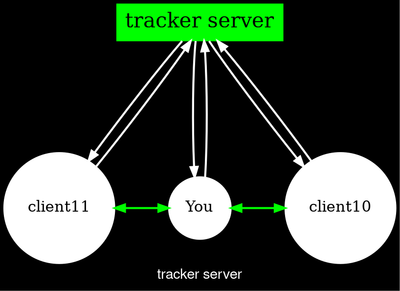

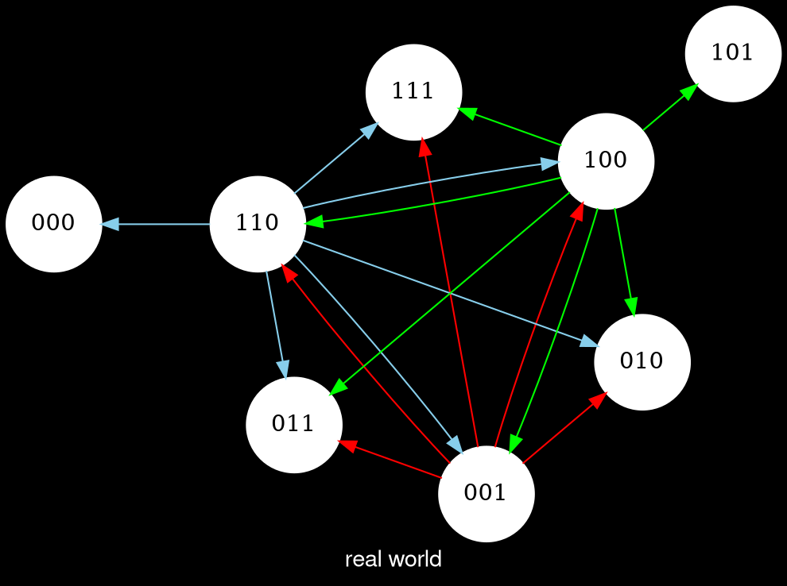

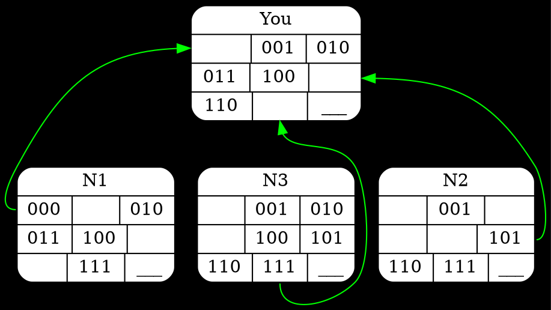

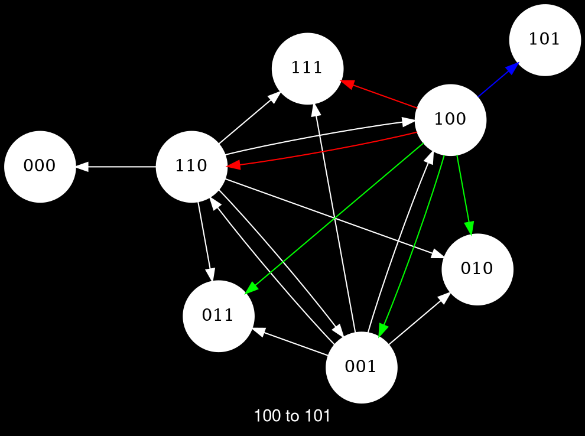

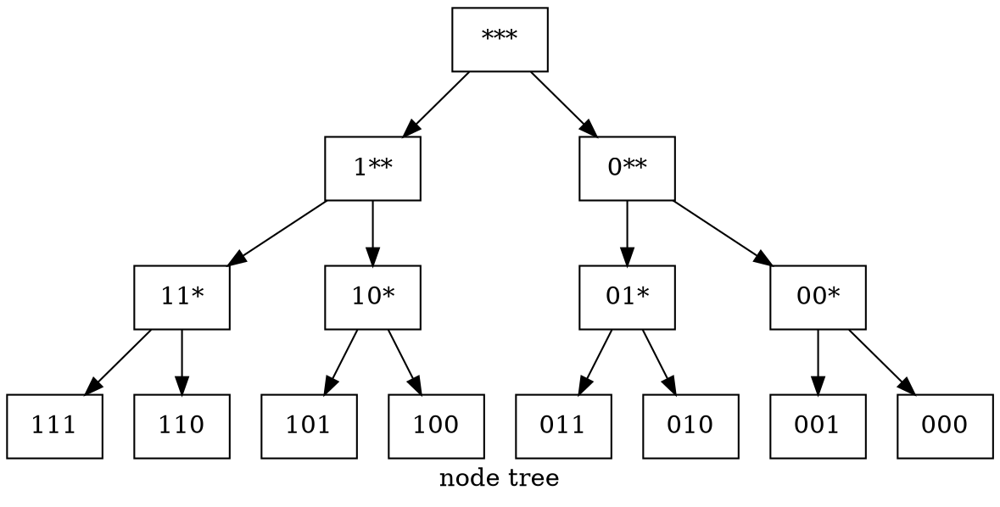

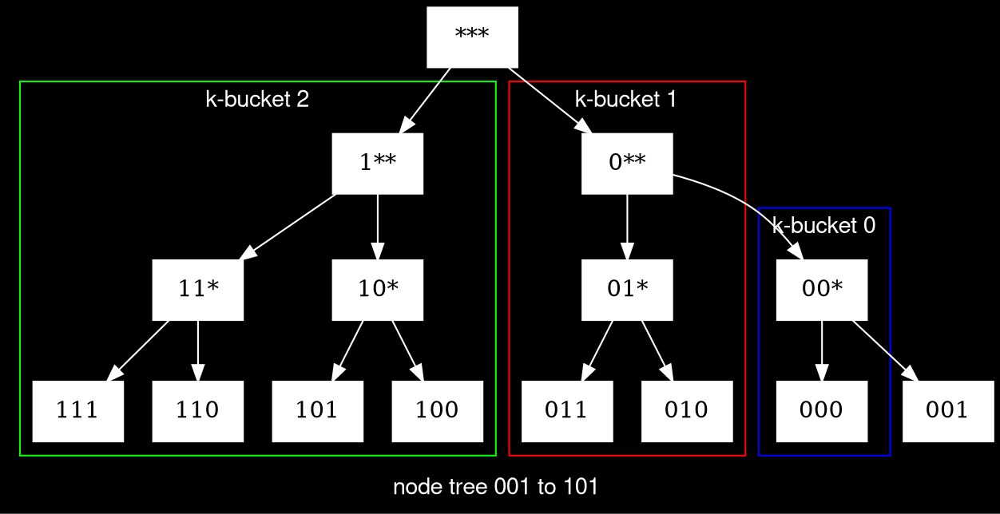

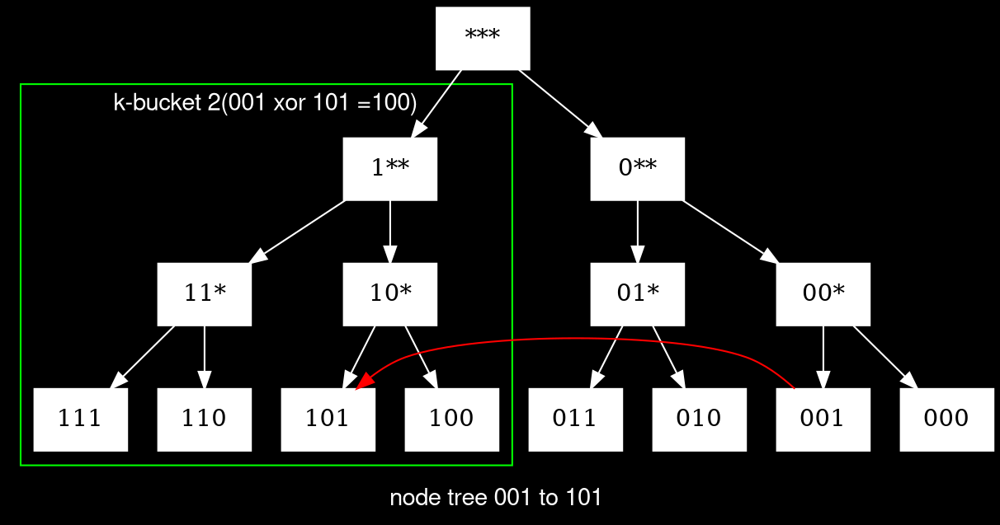
